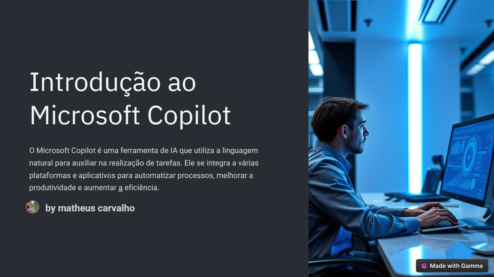
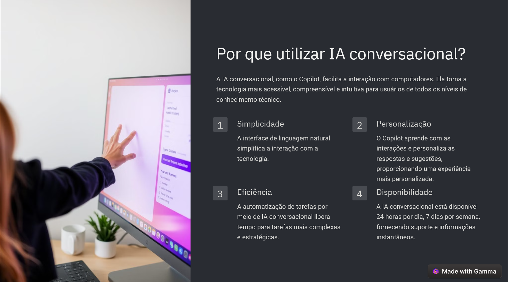
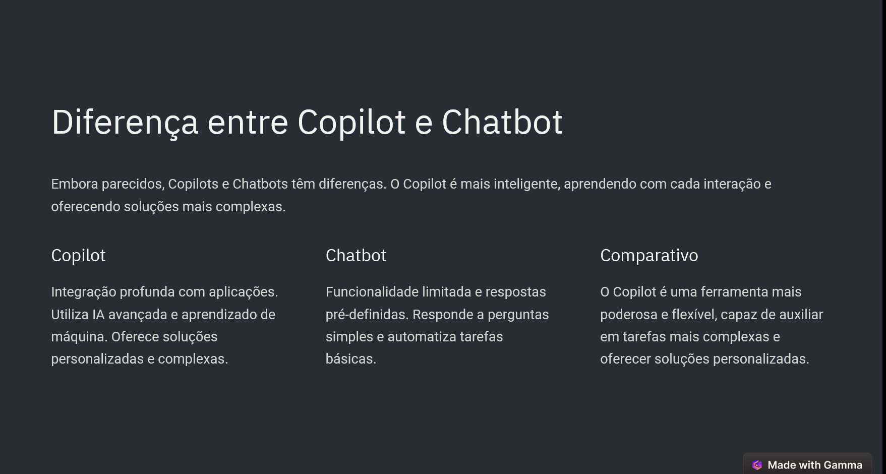
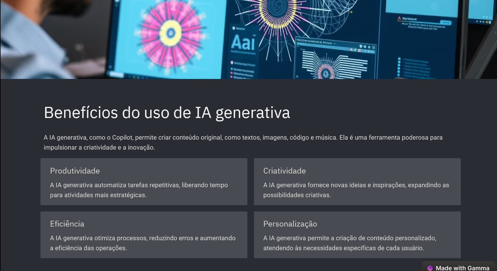
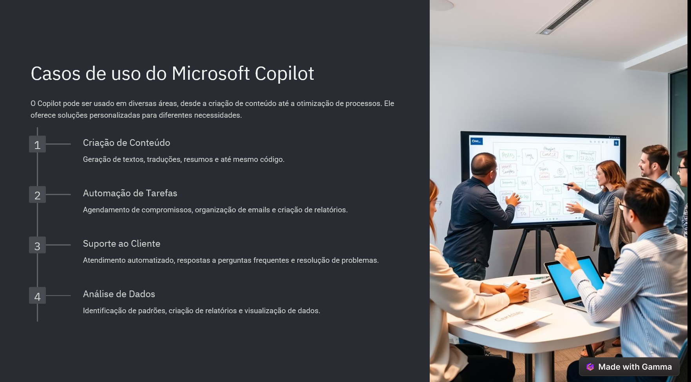
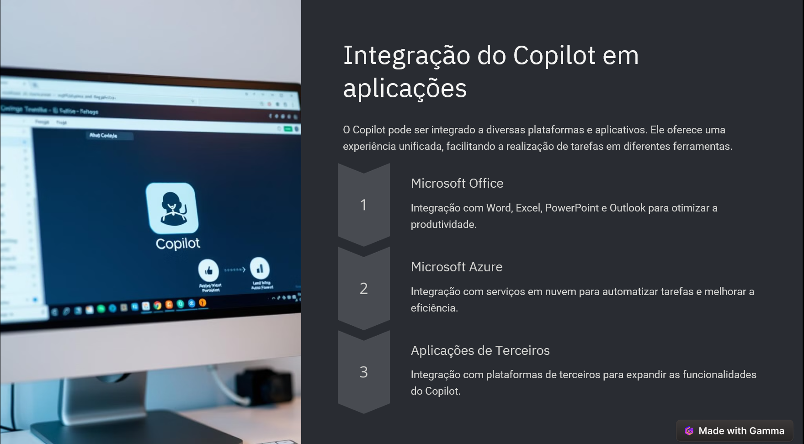
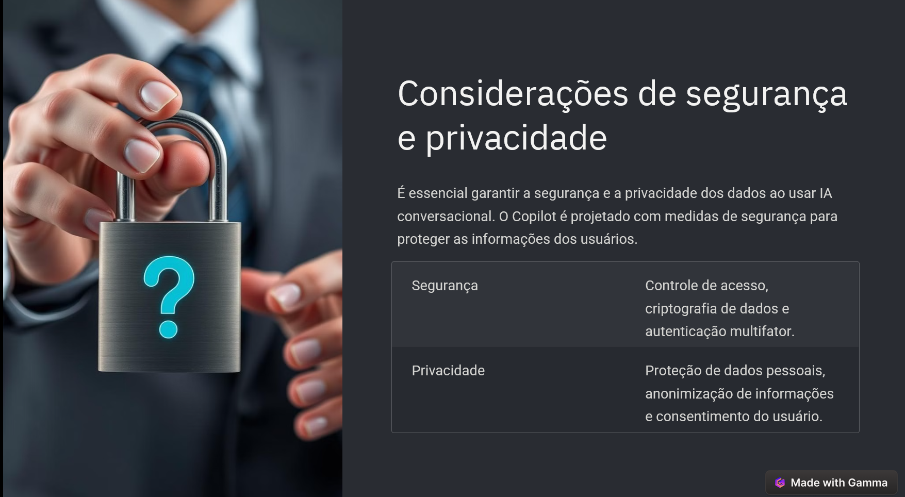

# Introdução ao Microsoft Copilot

## 📒 Descrição
Foi gerado uma apresentação em power point explicando o Copilot Estudio, abordando temas como porque utilizar IA conversional, a diferença entre copilot e chatbot, casos de uso, considerações sobre segurança e privacidade.

## 🤖 Tecnologias Utilizadas
Gamma.app

## 🧐 Processo de Criação
Com base nas apresentações e aulas do curso criei um resumo das tarefas e apartir do prompt do Gamma.app foi desenvolvido a apresentação.

## 🚀 Resultados

